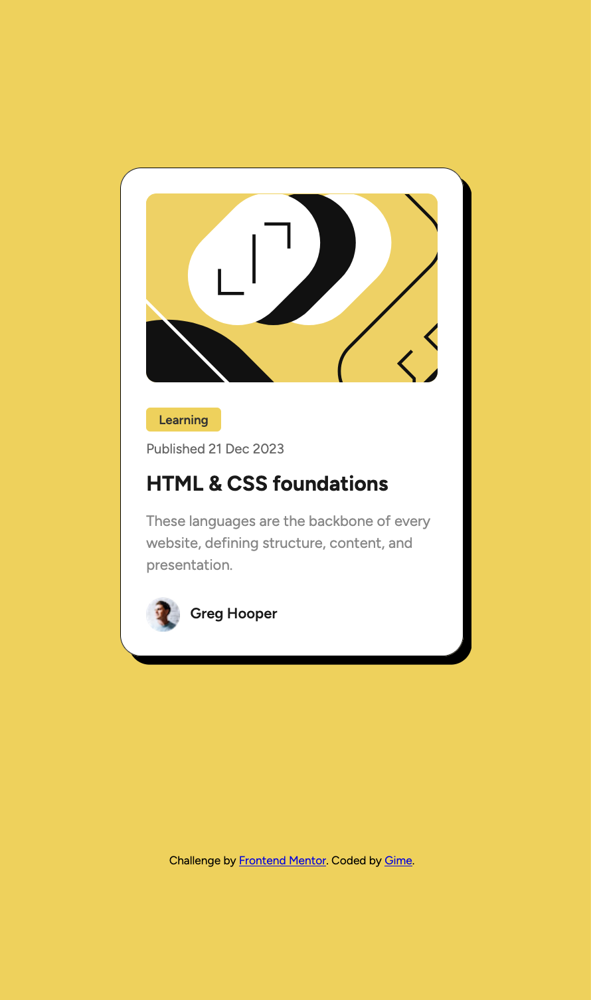
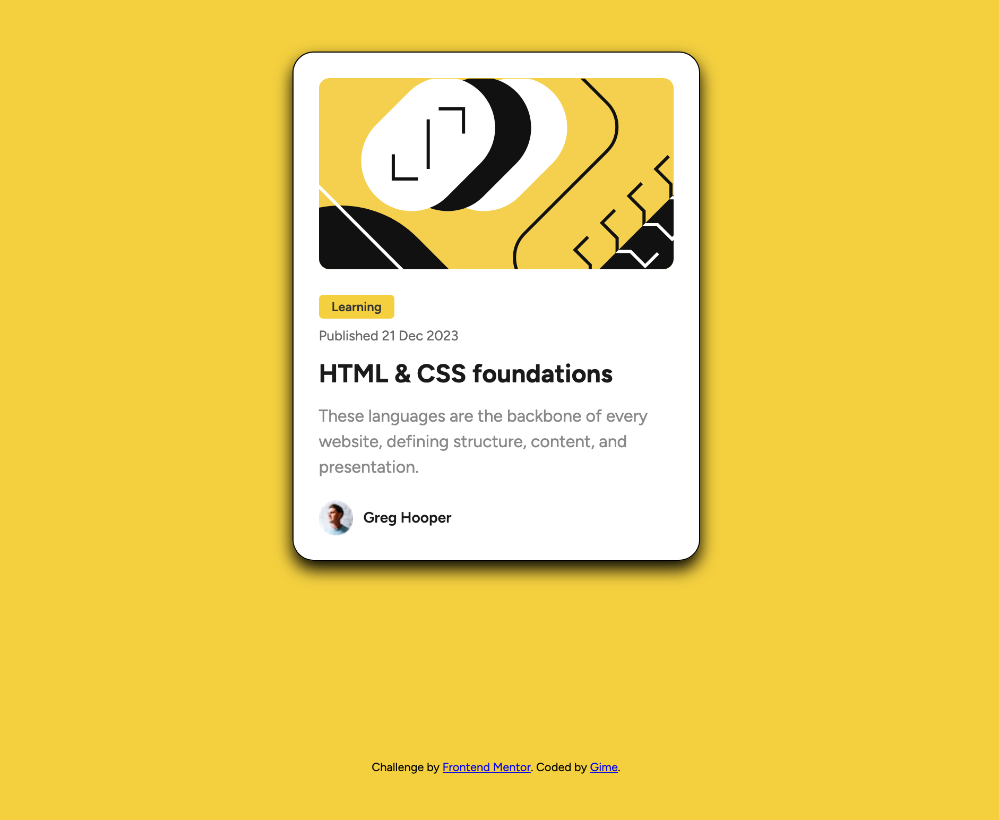

# Frontend Mentor - Blog preview card solution

This is a solution to the [Blog preview card challenge on Frontend Mentor](https://www.frontendmentor.io/challenges/blog-preview-card-ckPaj01IcS). Frontend Mentor challenges help you improve your coding skills by building realistic projects. 

## Table of contents

- [Overview](#overview)
  - [The challenge](#the-challenge)
  - [Screenshot](#screenshot)
  - [Links](#links)
- [My process](#my-process)
  - [Built with](#built-with)
  - [What I learned](#what-i-learned)
  - [Continued development](#continued-development)
  - [Useful resources](#useful-resources)
- [Author](#author)
- [Acknowledgments](#acknowledgments)

## Overview

### The challenge

Users should be able to:

- See hover and focus states for all interactive elements on the page

### Screenshot

### Links

- Solution URL: (https://github.com/GimeVerdant/blog_preview_card)
- Live Site URL: (https://gimeverdant.github.io/blog_preview_card/)

## My process

### Built with

- Semantic HTML5 markup
- CSS custom properties
- Flexbox
- Mobile-first workflow

### What I learned

Using Flexbox
Mobile first 
Hover states 

### Continued development

I would like to use Tailwind to target a group of elements for a hover state.
I had trouble with the avatar image in webp format not resizing to fit the container - so I changed it to a png. I still dont understand why that was happening.

### Useful resources

- (https://css-tricks.com/snippets/css/a-guide-to-flexbox/) - This helped me understand flexbox because it has very clear illustrations.

